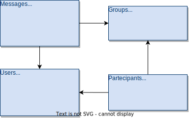
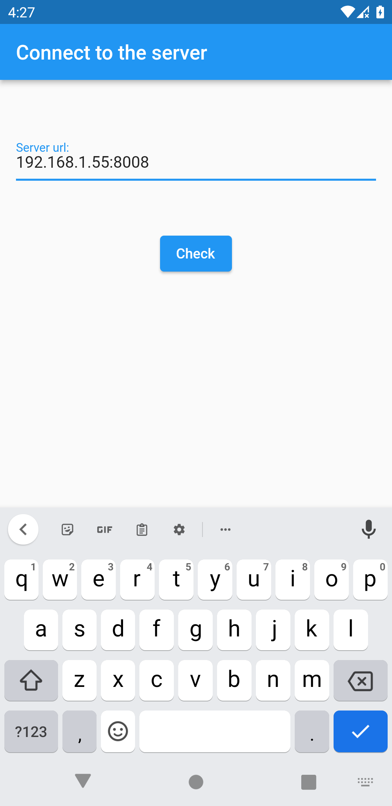
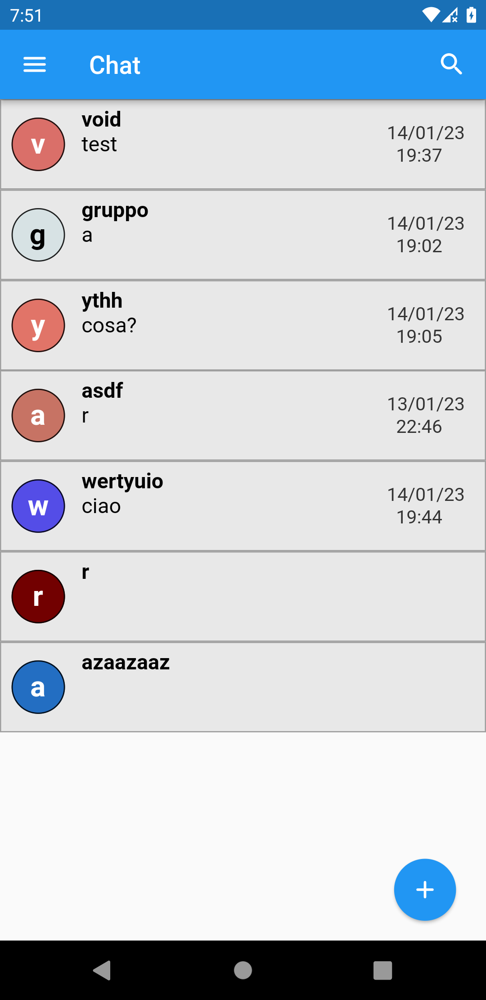
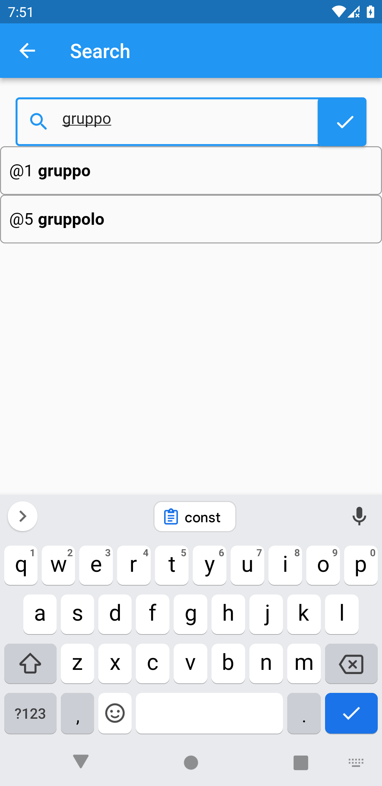
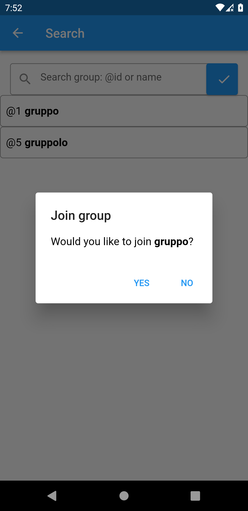
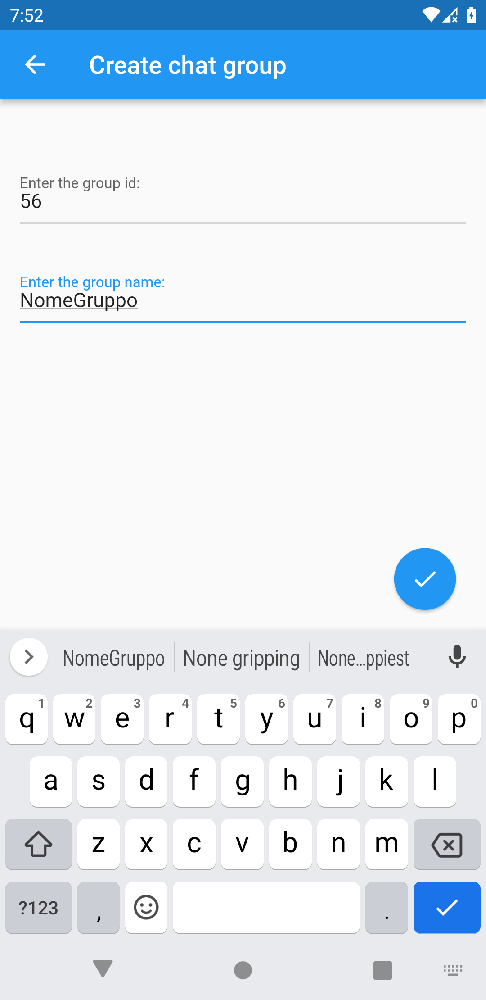

# Chatroom

## Progetto

Un'applicazione in cui ci sono più stanza discussione, gli utenti possono connettersi e scambiarsi messaggi.

## Server

Server realizzato in dart con i websocket, il server tiene conto degli utenti connessi e del gruppo selezionato, una volta che un utente invia un messaggio il server notifica tutti gli utenti che hanno selezionato quel gruppo

### API

Alcuni metodi sono stati realizzati non tramite il websocket, bensì tramite il protocollo **HTTP**, con i metodi **GET** e **POST**

Questi metodi sono stati utilizzati per permettere di creare un utente, il gruppo e per ottenere alcune informazioni riguardo la disponibilità di alcuni id

I metodi sono:

- POST
    - `/user` crea l'utente
    - `/group` crea il gruppo
    - `/join` aggiunge l'utente al gruppo
    - `/getUser` ritorna l'utente, dato l'id e la password
    - `/getGroups` ritorna i gruppi con un nome simile o uguale
    - `/getGroupID` ritorna il gruppo con quell'id
- GET
    - `/id` controlla se esiste l'id dell'utente
    - `/idgroup` controlla se esiste l'id del gruppo
    - `/status` ritorna lo stato del server

## DataBase
MySQL database strutturato secondo la seguente struttura:

in cui gli utenti hanno un id identificativo che è una stringa di 16 caratteri, mentre i gruppi hanno un intero

## Client

Il client che interagisce con il server, cerca di rispondere agli errori che il server gli comunica, per esempio se il server lo informa che non si è neancora identificato, il client ri-invia il messaggio di identificazione

### StreamController

Una volta che dal client ascoltiamo il websocket del server possono esserci 4 tipi di messaggi:

- messaggio di una chat
- lista delle chat
- gli ultimi 20 messaggi di una chat
- messaggio informativo

i primi 3 di questi vengono gestiti dall'utente, che passerà uno streamcontroller per ogniuno di questi eventi, il client quindi aggiungerà allo stream il messaggio appropriato.

Il messaggio informativo invece viene gestito dal client, esso può essere di 2 nature: utente non identificato e gruppo non selezionato

## GUI

### Connessione al server

Pagina di connessione al server

### Pagina principale

L'immagine del gruppo sarà sempre la stessa, essa viene calcolata con una funzione in cui come parametro c'è il nome del gruppo.

### Cerca gruppo

è possibile ricercare il nome del gruppo, in cui vengono i primi 20 gruppi con il nome simile o uguale, ma è anche possibile ricercare il gruppo tramite l'id aggiungendo all'inizio il di esso il carattere: '@'

premendo sul nome del gruppo sarà possibile unirsi

### Creazione del gruppo

In questa pagina è possibile creare un gruppo.

### Copia del messaggio

Se l'utente tiene premuto sul testo del messaggio, esso verrà copiato negli appunti

### Visualizzazione messaggi precedenti

L'utente vede solamente i 20 messaggi precedenti, ma quando esso, nella pagina del gruppo, scorre verso l'alto vengono caricati i messaggi precedenti

## Possibili future implementazioni

### Password hashing

Bisognerà implementare una funzione che cripti le password degli utenti, in quanto le password nel database sono salvate in chiaro, questo oltre a creare problemi legali crea inoltre problemi se avviene una SQL injection

### Notifiche

Implementazione delle notifiche, per ogni messaggio inviato, magari ridurle ad un massimo di 3 per gruppo

### Storage

Implementare il salvataggio del server e dell'account sul dispositivo per favorire una migliore esperienza per l'utente.

Implementare inoltre il salvataggio delle chat, in modo tale da non creare un'eccessiva latenza nel server
