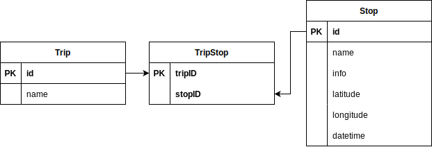
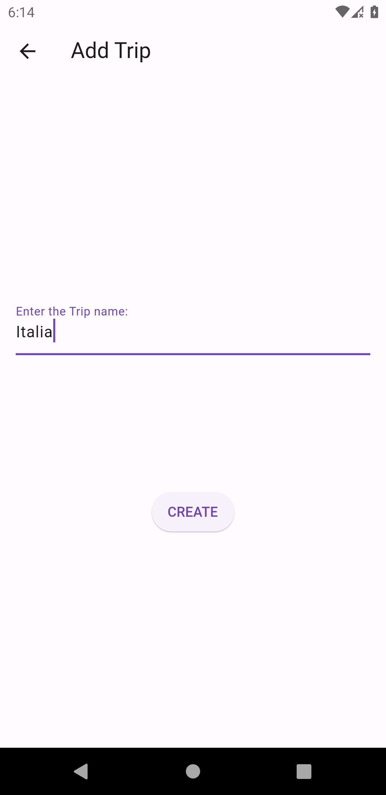
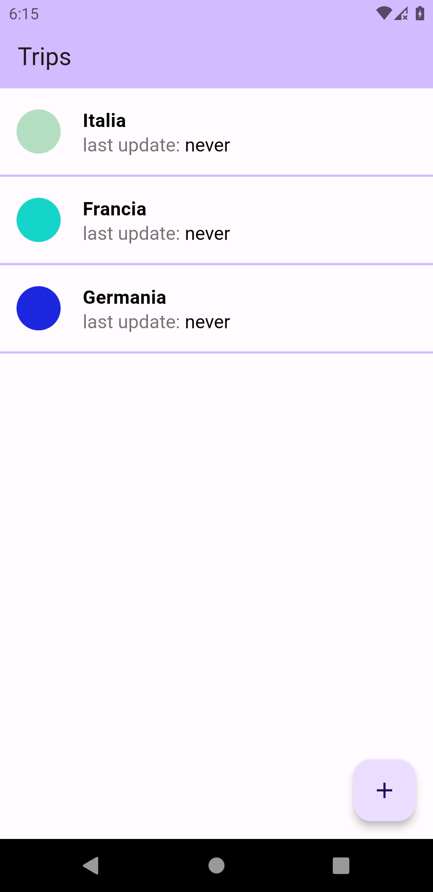
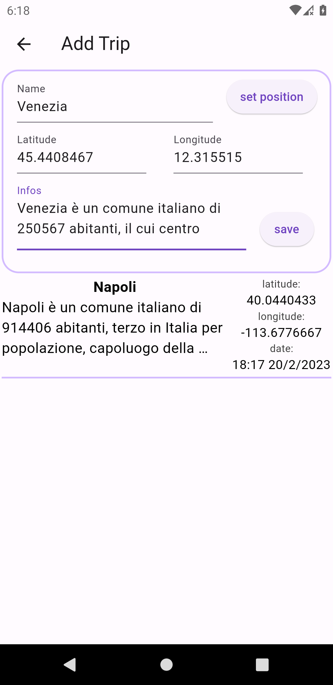
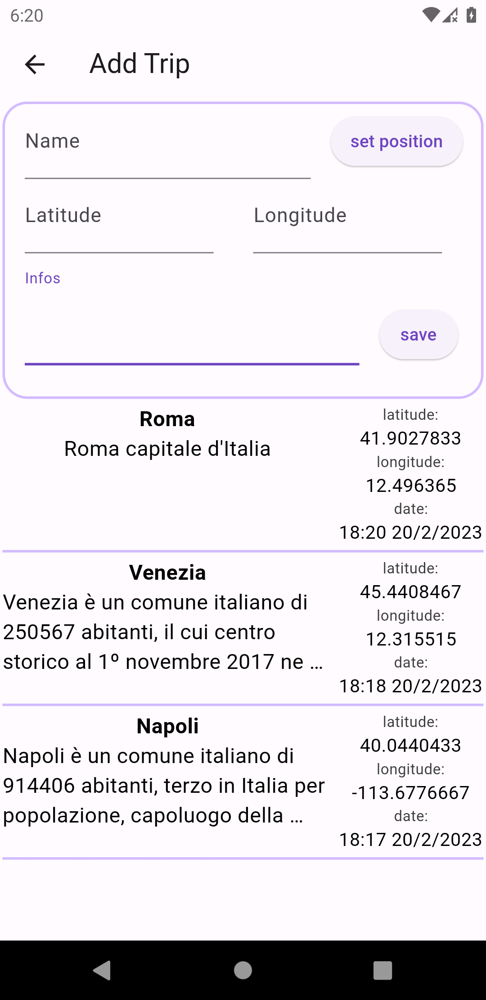
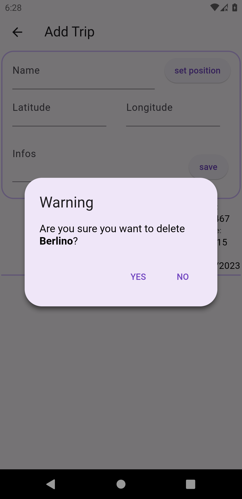
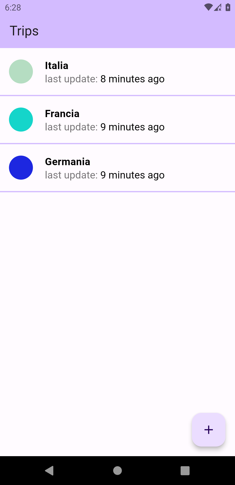
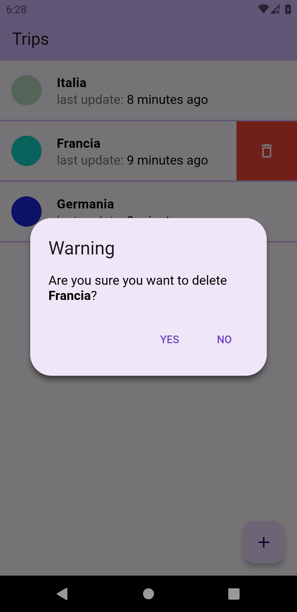

# journey

## Consegna

Centralizzando lo stato sul *dao* (vedi poi) si realizzi, usando SQLite e `floor` (ORM per SQLite), una applicazione di nome `journey` che permetta di registrare quanto segue.
- `Trip` ovvero percorsi fatti da `Stop`
- `Stop` ovvero singole fermate.
Ogni `Trip` è definito da una lista di `Stop` ha un nome e la data dell'ultimo aggiornamento. Ogni `Stop` possiede le due coordinate geografiche, un nome ed eventualmente altre informazioni. Chi utilizza l'app visualizza i `Trip` e per ogni `Trip` i dettagli degli `Stop`. Fra `Trip` e `Stop` vi è un legame molti a molti.

## DataBase

Attribuiamo quindi a `Trip` il nome, mentre per la data dell'ultimo aggiornamento possiamo trovarla, salvando negli `Stop` la data, così facendo si potrà visualizzarla per tutti e quando andiamo ad eliminare uno `Stop` sappiamo lo stesso la data dell'ultimo aggiornamento.

Lo `Stop` quindi avrà l'attributo *datetime* che non abbiamo inserito in `Trip` per i motivi precedentemente discussi, un nome, delle informazioni, la latitudine e la longitudine

Invece il `TripStop` avrà solamente le due chiavi primarie di entrambi per fare il collegamento

realizziamo quindi il seguente database



## Entity

Vediamo l'entità dell'`TripStop`

```dart
import 'package:floor/floor.dart';

@Entity(primaryKeys: ['tripID', 'stopID'])
class TripStop {
  final int tripID;
  final int stopID;
  TripStop(this.tripID, this.stopID);
}
```

notiamo la scrittura delle multiple chiavi primarie

vediamo ora quella del `Trip`

```dart
import 'package:floor/floor.dart';

@entity
class Trip {
  @PrimaryKey(autoGenerate: true)
  int? id;
  final String name;
  Trip(this.id, this.name);
}
```

notiamo che la chiave primaria viene generata automaticamente, simile all'`AUTOINCREMENT`, il campo id è *nullable* perché quando creo l'oggetto voglio che sia l'ORM `floor` ad assegnargli la chiave primaria

## Provider

in questo progetto è stato utilizzato anche il provider `Provider` 

inizializziamo lo scopo del provider nel main

```dart
class MyApp extends StatelessWidget {
  const MyApp({super.key});

  @override
  Widget build(BuildContext context) {
    return MaterialApp(
        title: 'Trips',
        theme: ThemeData(
          colorScheme: ColorScheme.fromSeed(seedColor: Colors.deepPurple),
          useMaterial3: true,
        ),
        home: ChangeNotifierProvider<TripsTracker>(
          create: (context) => TripsTracker(),
          child: const MyHomePage(title: 'Trips'),
        ),
        debugShowCheckedModeBanner: false);
  }
}
```

scriviamo la classe che gestisce il provider, il metodo `update` va a chiedere tutti i `Trip` al database e per ogniuno chiede inoltre la data dell'ultimo aggiornamento, va poi a notificare tutti gli ascoltatori (questo esegue il refresh della pagina), infine va a richiamare la stessa funzione 1 minuto dopo se è chiamata solamente 1 volta, altrimenti ad ogni chiamata di `update` si creava un altro timer, potenzialmente aggiornando la pagina troppe al secondo.

dopo c'è l'altro metodo che va solamente ad aggiornare la pagina, senza fare richieste al database

```dart
class TripsTracker extends ChangeNotifier {
  List<Trip> _trips = [];
  List<Trip> get trips => _trips;
  int updating = 0;

  Future<void> update() async {
    ++updating;
    _trips = (await database.tripdao.findAllTripsOrdered());
    lastUpdateTripList =
        List.filled(_trips.length, DateTime.fromMillisecondsSinceEpoch(0));
    for (int i = 0; i < _trips.length; ++i) {
      lastUpdateTripList[i] = DateTime.fromMillisecondsSinceEpoch(
          await database.tripstopdao.getLastUpdate(_trips[i].id!) ?? 0);
    }
    notifyListeners();
    if (updating == 1) {
      Future.delayed(const Duration(minutes: 1), update);
    }
    --updating;
  }

  void notifyOnly() {
    notifyListeners();
  }
}
```

un altro provider è stato utilizzato nella pagina **widget/add_stop.dart**, sempre per lo stesso concetto, ma questa volta al posto dei `Trip` ci sono gli `Stop`.

## Design

(il titolo *Add Trip* nella 3,4,5 immagine è stato aggiustato dopo la cattura delle immagini)

Pagina in cui vengono aggiunti i `Trip`



Pagina iniziale con tutti i `Trip` creati



Pagina in cui vengono creati gli `Stop`




Gli `Stop` possono anche essere cancellati





Anche i `Trip` possono essere cancellati


