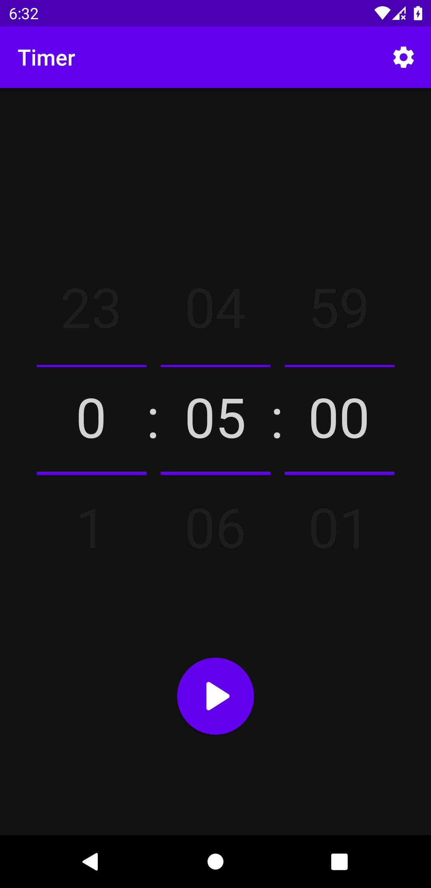
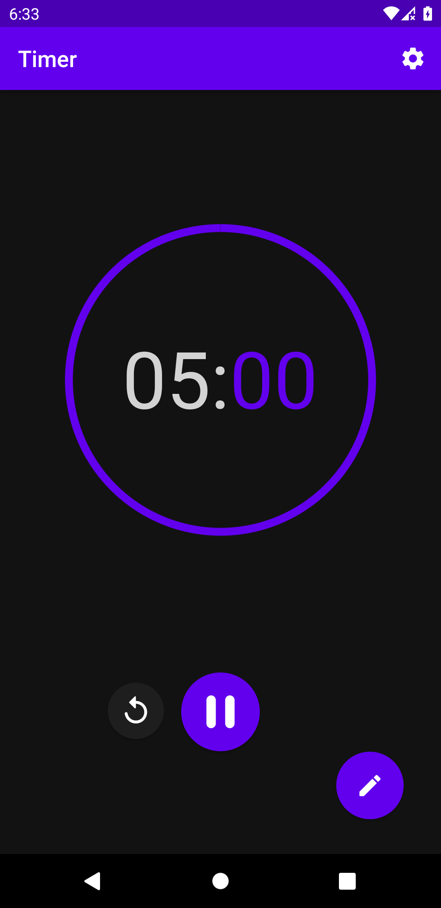
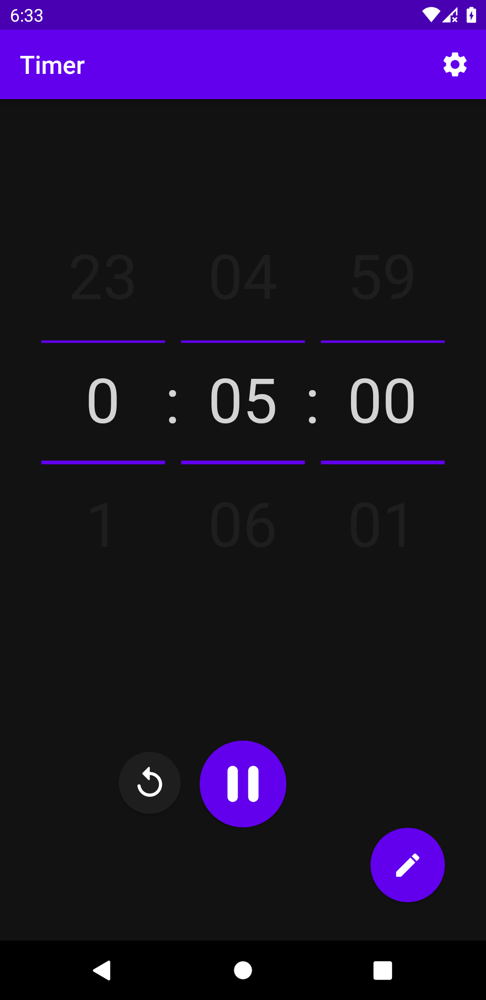
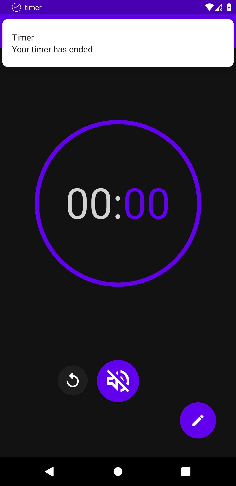
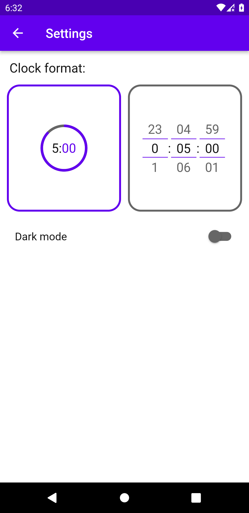
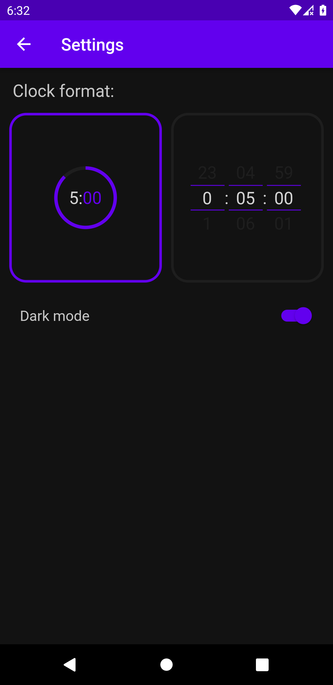

# Progetto Timer

## Schermata iniziale

In questa schermata selezioniamo l'orario del timer



## Formato timer 1



## Formato timer 2



## Timer terminato

Una volta terminato il timer comparirà una notifica per avvertire l'utente, inoltre il timer inizia a lampeggiare nel primo formato accompagnato da una suoneria



## Temi

Presente il tema chiaro e il tema scuro





## Logica del timer

Generiamo uno `Stream` che ad ogni secondo esegue la funzione `tick`, che essa aggiunge allo `StreamController` i secondi rimanenti


```dart
void tick(_) {
    if (counter <= 0) {
    streamController.close();
    return;
    }
    streamController.add(--counter);
}

void resume() {
    timer = Timer.periodic(const Duration(seconds: 1), tick);
}
```
